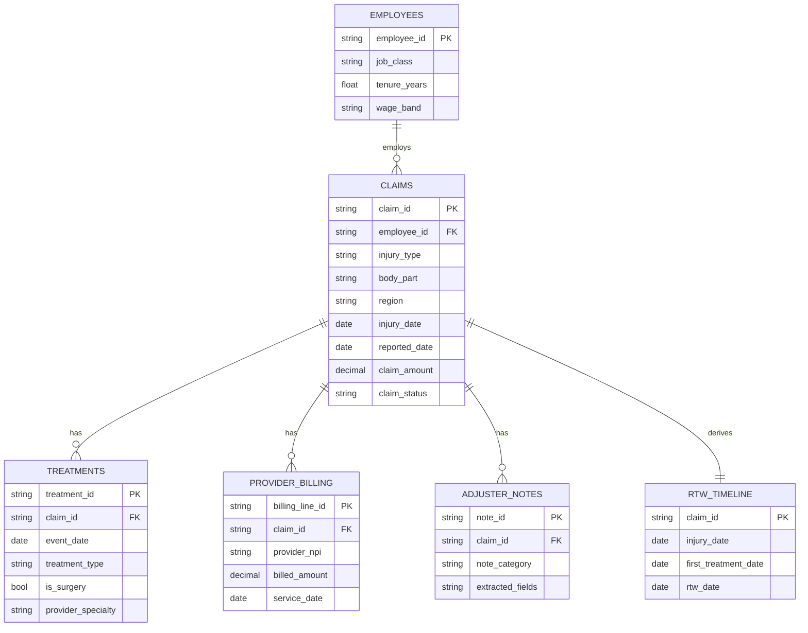

# Sample Data: From Raw Bronze to ML-Ready Gold

This POC ships with a fully synthetic workers' compensation dataset (no real claimant data). The same business key **claim_id** threads through every layer, so you can follow a single claim from its raw, dirty form in Bronze, through cleaned and governed Silver, into the engineered feature tables in Gold.

Two use cases share one source of truth:

- **Return-to-Work (RTW)** — predict the days it might take for a worker to return to work  `days_to_rtw` based on select attributes regarding their insurance claim (regression).
- **Fraud triage** — score claims with a `fraud_risk_score` to rank them for SIU review (classification).

> The data is generated by `data/generate_synthetic_data.py` (seeded for reproducibility). A small share of rows is deliberately "dirty" so the Silver cleaning and governance demos have something to do.

## The source files (what lands in Bronze)

| Source file | Bronze table | Represents | Grain |
| --- | --- | --- | --- |
| `claims_core.csv` | `bronze.raw_claims` | Core claim record (simulates a claims DB) | one row per claim |
| `hr_records.csv` | `bronze.raw_hr_records` | Employee tenure, job class, wage, employer (simulates an HR DB) | one row per worker |
| `medical_treatments.json` | `bronze.raw_medical_treatments` | Treatment events per claim (nested `events[]`, simulates a clinical data feed) | one row per claim (nested) |
| `provider_billing.json` | `bronze.raw_provider_billing` | Billing lines per claim (nested `billing_lines[]`, simulates EDI 837) | one row per claim (nested) |
| `adjuster_notes.xlsx` | `bronze.raw_adjuster_notes` | Free-text adjuster notes with embedded fake PII | one row per note |
| `siu_labels.csv` | `bronze.raw_siu_labels` | Confirmed SIU fraud labels for a labeled subset (training only) | one row per labeled claim |

`claims` and `adjuster_notes` feed **both** use cases.

## Medallion flow at a glance

```
Sources (files in ADLS)  →  Bronze (raw, as-landed)  →  Silver (clean, conformed, masked)  →  Gold (features + aggregates)
```

- **Bronze** keeps the data exactly as it landed — including the dirty patterns (mixed date formats, casing/whitespace, invalid SSNs, duplicates, an orphan FK, a poison row). It adds only `_source_file` and `_ingested_at` columns for tracking.
- **Silver** cleans, conforms, deduplicates (latest ingest wins), parses dates to ISO format, masks structured PII (SSN/DOB), redacts free-text PII, and structures notes with AI Functions. `silver.claims` is the primary entity or facts table. All supporting dimensions join on `claim_id`.
- **Gold** engineers one feature row per claim for ML, plus BI aggregates and the fraud scoring output.

## Entity relationships (Silver)

`silver.claims` is the hub. Every dimension joins on `claim_id` (or `employee_id` for the worker dimension). Gold tables are built by aggregating and feature-engineering dimensions back onto `claim_id`.



## Layer-by-layer dictionary

### Bronze — raw, as-landed

| Table | Represents | Notes |
| --- | --- | --- |
| `raw_claims` | Claim hub, exactly as ingested | Contains the dirty patterns; `claimant_name`, `ssn`, `dob` still shown in plain text |
| `raw_hr_records` | Worker employment records | Mixed date/number formats |
| `raw_medical_treatments` | Nested treatment events | `events[]` kept intact |
| `raw_provider_billing` | Nested billing lines | `billing_lines[]` kept intact |
| `raw_adjuster_notes` | Free-text notes | Embedded fake PII (names, phones) |
| `raw_siu_labels` | Fraud labels (subset) | `claim_id`, `is_fraud` |

### Silver — cleaned, conformed, governed

| Table | Represents | Grain / key | Key transforms |
| --- | --- | --- | --- |
| `claims` | The conformed claim hub | PK `claim_id` | dedupe, ISO dates, normalized categories, **SSN/DOB masked** |
| `employees` | The worker dimension | PK `employee_id` | derived `tenure_years`, `wage_band` |
| `treatments` | One row per treatment event | PK `treatment_id`, FK `claim_id` | `events[]` exploded; `is_surgery` flag added |
| `provider_billing` | One row per billing line | PK `billing_line_id`, FK `claim_id` | `billing_lines[]` exploded, dollar amounts cast to proper types |
| `rtw_timeline` | Per-claim RTW milestones | PK `claim_id` | injury → first treatment → RTW dates |
| `adjuster_notes` | Structured + redacted notes | FK `claim_id` | PII redacted, `note_category` via (`ai_classify`), `extracted_*` strucuted notes via (`ai_extract`) |

### Gold — ML-ready features + analytics

| Table | Represents | Grain | Purpose |
| --- | --- | --- | --- |
| `rtw_features` | RTW feature vector + label | one row per claim | **Trains** the RTW regression model (`days_to_rtw`) |
| `fraud_features` | Fraud signal features + label | one row per claim | **Trains** the fraud classification model (`is_fraud`) |
| `fraud_scores` | Model scoring output | one row per scored claim | **Drives** the triage queue (`fraud_risk_score`, `risk_tier`) |
| `rtw_outcomes_summary` | RTW KPIs aggregated | injury_type × region | **Powers** the dashboard + Genie |

## The Gold tables in detail

### `gold.rtw_features` — RTW regression training table

One row per claim. Engineered from `claims` + `employees` + `treatments` + `rtw_timeline`.

`claim_id`, `injury_type`, `body_part`, `age_band`, `job_class`, `tenure_years`, `wage_band`, `treatment_count`, `days_to_first_treatment`, `surgery_flag`, `provider_specialty`, `region`, `prior_claims_count`, **`days_to_rtw`** *(label — closed claims only)*.

### `gold.fraud_features` — fraud classification training table

One row per claim. Engineered from `claims` + `provider_billing` + `adjuster_notes`.

`claim_id`, `claim_amount`, `billing_total`, `billing_vs_claim_ratio`, `provider_claim_count_30d`, `distinct_providers`, `days_injury_to_report`, `weekend_injury_flag`, `note_fraud_signal`, `prior_claims_count`, `attorney_flag`, **`is_fraud`** *(label — labeled SIU subset only)*.

### `gold.fraud_scores` — serving output

`claim_id`, `fraud_risk_score`, `risk_tier` (Low/Medium/High), `top_contributing_factor`, `scored_at`. Written by the batch-scoring job and read by the Streamlit triage app.

### `gold.rtw_outcomes_summary` — BI aggregate

`injury_type`, `region`, `claim_count`, `avg_days_to_rtw`, `pct_surgery`, `avg_treatment_count`. The table behind the RTW dashboard and Genie questions like "which injury types have the longest average RTW by region?"
